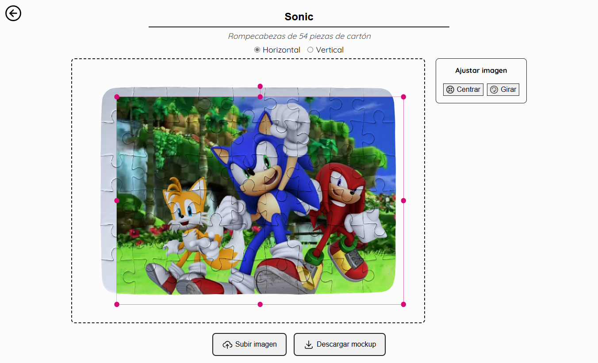

# PuzzleMockupsMaker

*Este proyecto es uno de los DEMO Open Source desarrollado originalmente para Sublimación STAMPAD. Está bajo licencia MIT.

Esta herramienta permite cargar un diseño y realizar mockups de rompecabezas con diferentes piezas, sin fondo para MercadoLibre. ✨



## Instalación & Dependencias

[Angular CLI](https://github.com/angular/angular-cli) version 15.2.6.

* **`npm install` para instalar todas las dependencias.**
* `ng serve` levantar el servidor de desarrollo en `http://localhost:4200/`.
  
**Librerías Externas:**
| Nombre       | Versión | Uso              | Documentación/Demo web                       |
|--------------|---------|------------------|----------------------------------------------|
| [fabric5.js](https://fabric5.fabricjs.com/)    | v5.3.0  | Manipulación de imágenes para canvas HTML5 | https://fabric5.fabricjs.com/docs/ |
| [ngx-toastr](https://github.com/scttcper/ngx-toastr)   | v16.2.0 | Notificaciones emergentes | https://ngx-toastr.vercel.app/ |

## Para crear nuevos mockups

Utiliza datos que provienen desde src/app/data/mockups-list.data.ts en su constante `MOCKUPS`. Para agregar un nuevo mockup, se debe agregar un nuevo objeto con la siguiente estructura modelo:

```typescript
export interface Mockup {
  id: string;
  title: string;
  shortTitle: string;
  img: string;
  svg: string
}
```

* **id**: "`número`p-`material`" (`número` = cantidad de piezas). Va en el routing.
* **title**: "Rompecabezas de `cantidad` piezas de `material`". 
* **shortTitle**: "`número`p `material`". Irá en el nombre de la descarga de la imagen.
* **img**: `${imgsRoute}/<id>-mockup.png`. **Ruta de la imagen mockup del fondo del canvas.**
* **svg**: `${imgsRoute}/<id>-clip_path.svg`. **Ruta del archivo SVG que realiza el clip path en el canvas.**
